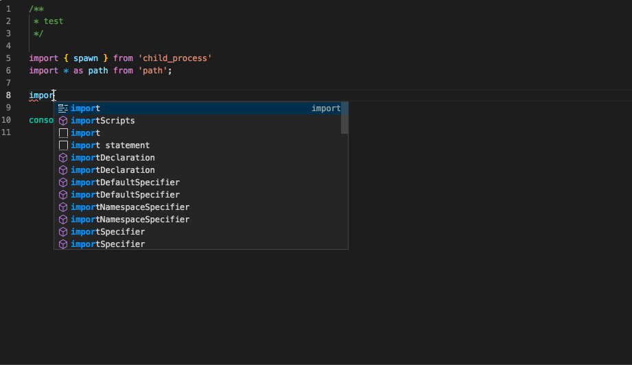
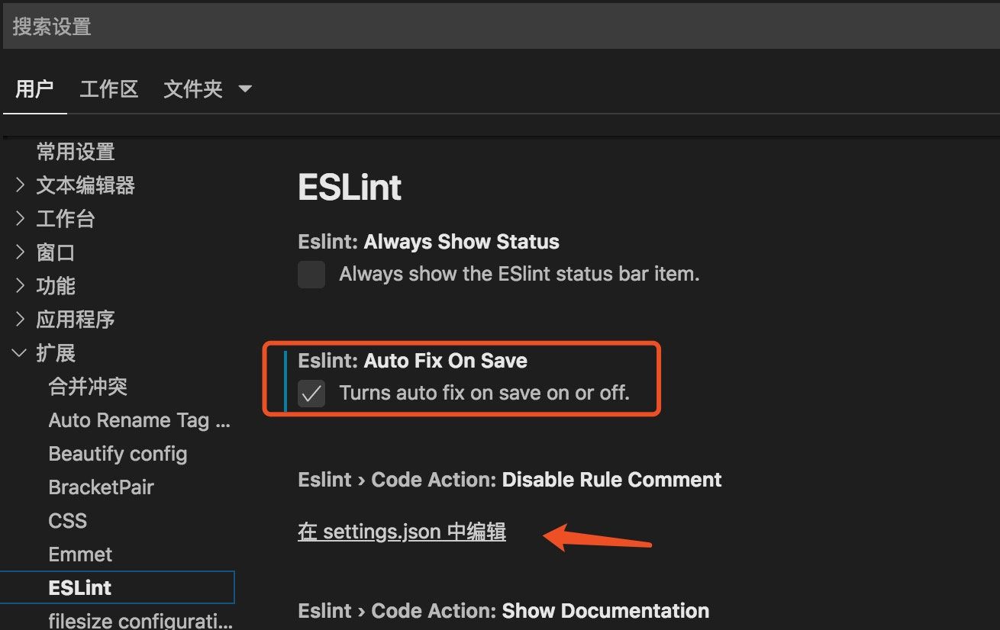
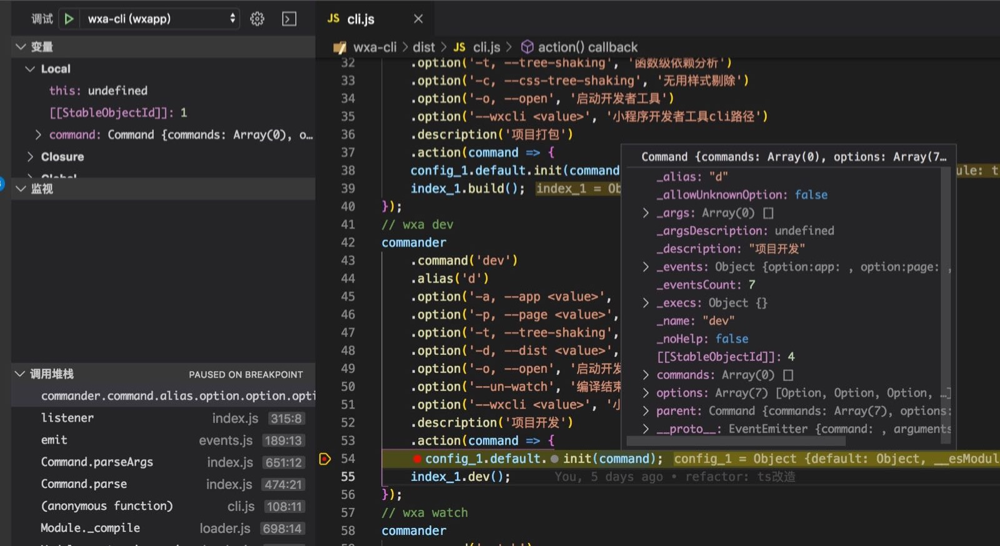
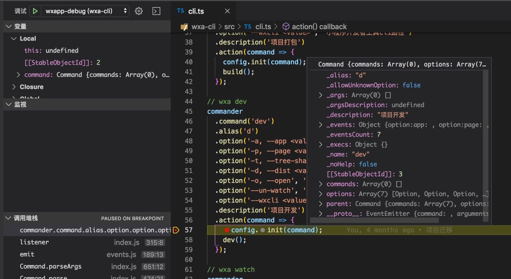

# 小程序CLI开发指引
欢迎加入开发，一起完善。

## 如何加入
1. PR(fork代码)或者MR(拉分支)均可。
2. clone代码后，项目根目录执行`lerna bootstrap`安装项目依赖，项目根目录执行`npm link`命令，让系统使用本地的dm-cli


## 核心代码 dm-cli 项目结构
```
|-- assets            # 存放项目的图片、视频等资源文件
|-- bin               # CLI命令入口
|-- dist              # 项目使用ts开发，dist为编译后文件目录，注意package.json中main字段要指向dist目录
|-- docs              # 存放项目相关文档
|-- scripts           # 对应package.json中scripts字段需要执行的脚本文件
|-- src               # 源码目录，注意此目录只放ts文件，其他文件如json、模板等文件放templates目录
    |-- common        # 公共文件
    |-- impl          # 存放公共ts接口实现类
    |-- interfaces    # 存放公共ts接口
    |-- plugins       # 存放内置的插件
    |-- processes     # 存放子命令流程
    |-- index.ts      # api入口文件
|-- templates         # 存放json、模板等文件
|-- tests             # 测试文件目录
|-- typings           # 存放ts申明文件，主要用于补充第三方包没有ts申明的情况
|-- .commitlintrc.js  # git提交规范
|-- .eslintignore     # eslint忽略配置，可根据实际情况修改
|-- .eslintrc.js      # eslint规则配置，请勿修改
|-- .gitignore        # git忽略规则，可根据实际情况修改
|-- CHANGELOG.md      # 变更日志，自动生成
|-- CONTRIBUTING.md   # 开发指引
|-- jest.config.js    # jest配置文件，请勿修改
|-- package.json      # 
|-- README.md         # 使用说明
|-- tsconfig.json     # typescript配置，请勿修改
```

## 开发

### 使用TypesSript开发
1. 源码目录为 src，通过 npm run build 编译到dist目录
2. 源码全部使用 ts 文件，src 目录也只能放 ts 文件，其他文件(模板文件、json 文件等)，请放到 templates 目录
3. 引入 commonjs 规范的包时，如果其 ts 申明文件是 export = xx 的方式导出的，请使用 import mod = require('mod')导入，否则使用 import * as mod from 'mod' 导入
4. 如果安装的第三方包没有 ts 申明文件(包目录即没有 xx.d.ts 文件也没有对应的 ts 包 @types/xx)，请补充到 typings 目录，以包名作为子目录名
5. 文件顶部 import 顺序，import {fun} from 'mod'、import * as mod from 'mod'、import mod from 'mod'、import mod = require('mod')

### 代码规范
除了需要遵循eslint中配置的[standard规范](https://github.com/standard/standard/blob/master/docs/README-zhcn.md)及[ts官方规范](https://github.com/typescript-eslint/typescript-eslint/tree/master/packages/eslint-plugin)，还需要遵循以下几条简单的规则  
1. 异步操作 Promise 化，尽量使用 async/await，避免使用 Promise.then;。
2. 日志统一使用 common/log.js，注意 warn 和 error 都会输入到 stderr，提示性的日志使用 log。
3. 如需要在 webpack 的 compiler、compilation 或其他对象上挂载自定义变量，变量名约定用`$`开头，如 compiler.$fileCache;。
4. 文件名、文件夹名，若有多个单词，统一使用中划线连接。

### VSCode中集成ESLint配置
为了开发方便我们可以在VSCode中集成ESLint的配置，一是用于实时提示，二是可以在保存时自动fix。
  
1. 安装VSCode的ESLint插件
2. 修改ESLint插件配置：设置 => 扩展 => ESLint => 打钩(Auto Fix On Save) => 在setting.json中编辑，如图
  
3. 由于eslint默认只校验.js文件，因此需要在在setting.json中添加eslint相关配置：
```js
{
    "eslint.enable": true,  //是否开启vscode的eslint
    "eslint.autoFixOnSave": true, //是否在保存的时候自动fix eslint
    "eslint.options": {    //指定vscode的eslint所处理的文件的后缀
        "extensions": [
            ".js",
            // ".vue",
            ".ts",
            ".tsx"
        ]
    },
    "eslint.validate": [     //确定校验准则
        "javascript",
        "javascriptreact",
        // {
        //     "language": "html",
        //     "autoFix": true
        // },
        // {
        //     "language": "vue",
        //     "autoFix": true
        // },
        {
            "language": "typescript",
            "autoFix": true
        },
        {
            "language": "typescriptreact",
            "autoFix": true
        }
    ]
}
```
4. 若遇到VSCode无法提示，可尝试重启下ESLint插件、将项目移出工作区再重新加回来。

## 调试
### 方法一、调试生成后的dist文件
VSCode参考配置(/path/to/project/.vscode/launch.json)如下

```json
{
  "configurations": [{
    "type": "node",
    "request": "launch",
    "name": "dm-debug-js",
    "program": "${workspaceFolder}/bin/dm-build",
    "cwd": "/path/to/app",
    "args": [
        "build"
    ]
  }]
}
```
  

### 方法二、直接调试ts文件-借助vscode
```json
{
  "type": "node",
  "request": "launch",
  "name": "dm-ts-debug",
  "program": "${workspaceFolder}/src/debug.ts",
  // "preLaunchTask": "tsc: build - tsconfig.debubg.json",
  "outFiles": ["${workspaceFolder}/dist/**/*.js"],
  "cwd": "${workspaceFolder}/tests/__mocks__/app-npm",
  "args": [
    "build"
  ]
}
```
> 1：debug.ts 仅做 ts 入口调试及演示使用，CLI 实际入口在 bin 目录。  
> 2：调试前记得前开启watch模式：`npm run watch`。

  

### 方法三、直接调试ts文件-借助ts-node
使用 ts-node 进行调试，VSCode 参考配置如下，详见[ts-node](https://github.com/TypeStrong/ts-node#visual-studio-code)
```json
{
  "configurations": [{
    "type": "node",
    "request": "launch",
    "name": "dm-debug-ts",
    "runtimeArgs": [
      "-r",
      "ts-node/register"
    ],
    "args": [
      "${workspaceFolder}/src/debug.ts",
      "config"
    ]
  }]
}
```
> 1：debug.ts 仅做 ts 入口调试及演示使用，CLI 实际入口在 bin 目录。  
> 2：由于大部分 CLI 命令需要在 app 目录下执行，而 ts-node 又要求在 dm-cli 目录下执行(否则会找不到 ts-node 运行时，暂时没找到如何配置)。待 CLI 支持 cwd 参数后可解决。  


## 提交commit
commit message 遵循[AngularJS’s commit message convention](https://github.com/conventional-changelog/commitlint)

### 基本公式
```xml
<type>(<scope>): <subject>
// 空一行
<body>
// 空一行
<footer>
```
示例：fix(dm-cli): 修复dm build命令xx bug。

### type类型说明
* feat：增加新功能
* fix：修复bug
* docs：文档变更
* style：代码格式（不影响功能，例如空格、分号、注释等格式修正）
* refactor：代码重构
* perf：改善性能、修改提示
* test：增加测试
* build： 变更项目构建或外部依赖（例如scopes: webpack、gulp、npm等）
* ci：更改持续集成软件的配置文件和package中的scripts命令，例如scopes: Travis， Circle等
* chore：变更构建流程或辅助工具
* revert：代码回退

### 自动生成changelog
1. 项目使用[conventional-changelog-cli](https://github.com/conventional-changelog/conventional-changelog)自动生成changelog
2. 生成的文档包括三部分：New features、Bug fixes、Breaking changes.意味着只有feat、fix以及footer部分以`BREAKING CHANGE`开头申明不兼容变动时才会生成日志，其他type的提交会自动忽略
3. feat、fix 统一都加上 scope，scope 可以是针对某个命令，也可以是针对某个包(monorepo)